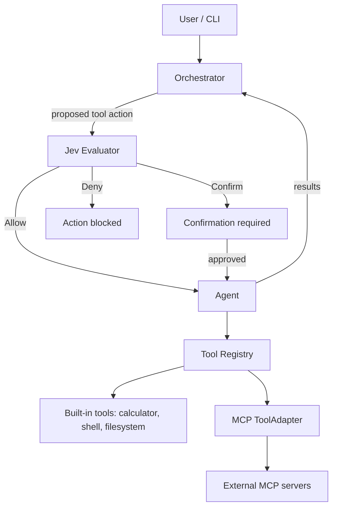

<div align="center">

# Deepesh Kumar Pandey

### Systems & Backend Engineer &nbsp;|&nbsp; Go · C++ · Infrastructure

**Durable storage · Concurrent pipelines · LLM agent tooling**

Computer Science undergraduate (2023–2027) focused on performance, reliability, and clean, testable code.

[](https://linkedin.com/in/deepesh-kumar-pandey-013233288)
[](https://github.com/deepesh-kumar-pandey)
[](https://leetcode.com/u/Deepesh_Kumar_Pandey)
[](https://hackerrank.com/profile/deepesh040505)

</div>

---

## Highlights

| | |
|---|---|
| **2.93M req/s** | Agent Harness sustained throughput with 391 ns P99 latency across 300K concurrent tool calls |
| **2.74M req/s burst** | Agent Harness at 20K concurrent burst load: 621 ns P99 latency, 0 errors |
| **Race-detector validated** | No data races across sustained and burst workloads |
| **~5.4M ops/s** | LRU cache hit throughput (183 ns) in a Go log engine with an fsync-backed WAL |
| **300K requests** | Load-tested C++ automation engine: 100% success, 1,258 req/s, p99 under 130 ms in steady mode |
| **MCP + sessions** | Go agent runtime with an orchestrator loop, MCP client, CLI, and SQLite-backed session storage |
| **Failure-first design** | Crash recovery, atomic writes, panic recovery, and race-detector-tested concurrency |

---

## About

I build backend and infrastructure software with a focus on **correctness under failure**: crash recovery, thread safety, bounded resource use, and measurable performance. I started in modern C++ (rate limiters, health monitors, async task engines) and now work primarily in **Go** on storage engines, concurrent pipelines, and an LLM agent runtime.

**Focus areas:** durable storage (WAL, fsync, recovery) · concurrency · agent infrastructure (orchestration, MCP, sessions) · Docker and CI · observability and benchmarking

---

## Featured Projects

### 1. [Agent Harness](https://github.com/deepesh-kumar-pandey/Agent-harness) &nbsp;·&nbsp; Go

**A runtime for building and running tool-using AI agents.** The model supplies the intelligence; the harness supplies the tools, state, and execution loop. Includes an orchestrator loop, a registry-based tool layer, an MCP client with a CLI, persistent sessions on file and SQLite backends, and **Jev**, a deterministic policy layer that decides whether each tool action is allowed, needs confirmation, or is denied before it runs.

`Go` · `Ollama` · `MCP` · `SQLite` · `GitHub Actions` &nbsp;|&nbsp; *Status: active development*

<details>
<summary><b>Architecture, capabilities, and usage</b></summary>

<br>



| Capability | Details |
|---|---|
| **Orchestrator** | Agent loop that executes each tool call through the Agent and returns results to the model |
| **Jev (action evaluation)** | Deterministic layer that evaluates each tool action before execution and returns Allow, Confirm, or Deny; integrated into the orchestrator ahead of tool execution |
| **Jev policies** | `Evaluator` and `Policy` interfaces; a basic policy that validates actions; a shell policy that requires confirmation for shell actions; a default evaluator resolving decisions with `Deny > Confirm > Allow` priority |
| **Agent** | Resolves tools through the registry; maintains in-memory conversation history |
| **Tool layer** | Common `Name() / Description() / Execute()` contract and a registry for registering and discovering tools |
| **Built-in tools** | Calculator, Shell (validated `exec.LookPath` execution with captured output), Filesystem (read/write/list/search/delete) |
| **MCP client** | Built on the official MCP SDK; identifies itself to servers by implementation name and version |
| **MCP ToolAdapter** | Wraps each discovered MCP tool behind the harness tool interface so the Agent treats it like any other tool |
| **MCP CLI** | `mcp list`, `mcp add <name> <command> [args...]`, `mcp remove <name>` with persisted config and duplicate-name validation |
| **Sessions** | Active-session switching; file-backed store with atomic writes (temp file + rename); SQLite-backed store with transactions and foreign-key cascade deletes |
| **Providers** | Ollama chat provider with request validation and an injectable HTTP client |
| **Quality** | Unit and integration tests (85.3% overall coverage, 100% on Jev); example config with no credentials; GitHub Actions for formatting, tests, and `go vet` |

```bash
agent-harness mcp list
agent-harness mcp add <name> <command> [args...]
agent-harness mcp remove <name>
```

```go
type Tool interface {
    Name() string
    Description() string
    Execute(args map[string]any) (any, error)
}
```

**Use cases:** local-LLM tool-calling agents, policy-gated tool execution, extensible agent runtimes, testable provider and tool abstractions

</details>

---

### 2. [Durable Log Cache Engine](https://github.com/deepesh-kumar-pandey/durable-log-cache-engine) &nbsp;·&nbsp; Go

**A crash-resilient log ingestion and caching engine.** A write-ahead log, concurrent worker pipeline, LRU cache, and token-bucket rate limiter; data is durable before any acknowledgement.

`Go` · `Docker` · `Alpine Linux` &nbsp;|&nbsp; *Status: complete*

<details>
<summary><b>Features, benchmarks, and API example</b></summary>

<br>

**Key features**
- Binary-framed, fsync-backed WAL: durable before acknowledgement
- Crash recovery: replays the WAL on boot, restores the LRU cache, then compacts the log
- O(1) LRU cache index with hit-rate telemetry
- Worker pool with automatic panic recovery and self-healing replacement
- Token-bucket rate limiter with configurable burst depth; excess load shed with `429`
- HTTP API: `/submit`, `/lookup/{id}`, `/metrics`, `/health`
- Minimal multi-stage Alpine image running as `nobody`
- 20 tests across cache and pipeline packages, including race-detector coverage

| Component | Operation | Throughput | Latency |
|---|---|---|---|
| LRU Cache | Get (hit) | ~5.4M ops/sec | 183 ns |
| WAL (disk I/O) | Write + fsync | ~348K ops/sec | 2.8 µs |
| Rate Limiter | Allow (concurrent) | ~5.2M ops/sec | 189 ns |

<sub>Measured on AMD Ryzen 5 5600H.</sub>

```bash
curl -X POST http://localhost:8080/submit \
  -H "Content-Type: application/json" \
  -d '{"id":"TX-001","payload":"user_login_event"}'
# → 202 Accepted, WAL write in flight
```

**Use cases:** durable event ingestion, crash-safe log pipelines, low-latency lookup caches

</details>

---

### 3. [Automation Engine](https://github.com/deepesh-kumar-pandey/Automation-Engine) &nbsp;·&nbsp; C++ / React

**An asynchronous, JSON-driven task orchestration system** with a built-in threat-detection worker, HMAC-signed service calls, AES-256-GCM encrypted audit logs, and a live React dashboard.

`C++` · `CMake` · `vcpkg` · `OpenSSL` · `React` · `TypeScript` · `Docker` &nbsp;|&nbsp; *Status: core complete*

<details>
<summary><b>Features, benchmarks, and extension example</b></summary>

<br>

**Key features**
- **Async core:** non-blocking execution via `std::async` / `std::future`
- **Polymorphic workers:** extend through an abstract `Task` base class
- **Threat analyzer:** C++ TCP server that detects SQL injection patterns and blocks offending IPs in real time
- **Security integration:** `BlockIPTask` calls a rate limiter service with HMAC-SHA256 signed requests
- **Encrypted auditing:** logs encrypted on disk with AES-256-GCM to detect tampering
- **JSON-driven workflows:** routines defined declaratively in `routine.json`
- **React dashboard:** real-time monitoring with a live packet inspector
- **Delivery:** CMake + vcpkg; fully Dockerized (backend, frontend, relay)

| Mode | Throughput | Success rate | Avg latency | p99 latency |
|---|---|---|---|---|
| Steady (sustained) | 1,258 req/s | 100.0% | 50.58 ms | 128.97 ms |
| Burst (10K waves) | 1,258 req/s | 100.0% | 193.56 ms | 731.01 ms |

<sub>300K requests, 64 concurrent workers.</sub>

```cpp
class MyTask : public AutomationEngine::Task {
public:
    std::future<TaskStatus> execute(const json& input) override {
        return std::async(std::launch::async, [this, input]() {
            // your logic here
            return TaskStatus::Completed;
        });
    }
    std::string getName() const override { return "MyTask"; }
};
```

**Use cases:** workflow orchestration, intrusion detection and auto-blocking, encrypted audit logging, CI/CD-style automation

</details>

---

### More Projects

| Project | Description | Stack |
|---|---|---|
| [Gatekeeper](https://github.com/deepesh-kumar-pandey/API-project) | Thread-safe fixed-window rate limiter (O(1) lookups) with persistent state and zero external dependencies | C++11, POSIX threads, Docker |
| [DeepGuard](https://github.com/deepesh-kumar-pandey/Health-Monitoring-Service) | Cross-platform CPU/RAM/disk monitoring, database health checks, log obfuscation (AES-256-GCM upgrade in progress), native alerts | C++17, CMake, WinAPI/POSIX |
| [To-Do List](https://github.com/deepesh-kumar-pandey/To_do_list) | Task manager with persistent browser storage | JavaScript, HTML, CSS |
| [GUI Application](https://github.com/deepesh-kumar-pandey/GUI) | Desktop interface application | Python |

<details>
<summary><b>Gatekeeper and DeepGuard usage examples</b></summary>

<br>

```cpp
RateLimiter limiter(100, 60);  // 100 requests per 60 seconds
if (limiter.is_request_allowed("user123")) {
    // Process request
} else {
    // Return 429 Too Many Requests
}
```

```cpp
Monitor monitor(80.0, "alerts.log", encryption_key);
monitor.run_monitoring_cycle(5);  // check every 5 seconds
```

</details>

---

## Skills

**Languages** &nbsp;


**Infrastructure & DevOps** &nbsp;


**Build, Data & Frameworks** &nbsp;


<details>
<summary><b>Core competencies and development environment</b></summary>

<br>

**Systems & storage engineering**
- **Write-ahead logging:** binary framing, fsync durability, crash recovery, compaction
- **Atomic persistence:** temp-file-and-rename writes, transactional SQLite stores
- **Concurrent programming:** goroutines and channels in Go; mutexes and lock guards in C++
- **Memory management:** RAII patterns in C++; allocation profiling in Go
- **Performance optimization:** complexity analysis, benchmarking, low-allocation hot paths
- **Cross-platform development:** Windows, Linux, and macOS

**Agent & tooling architecture**
- **Tool interfaces:** uniform `Name() / Description() / Execute()` contracts
- **Orchestration:** separating "what to do" (orchestrator) from "how to do it" (agent and tools)
- **MCP integration:** client, tool discovery, adapter layer, CLI-managed server config
- **Provider abstractions:** swappable LLM providers with injectable, testable dependencies
- **Session management:** persistent conversation state across file and database backends

**DevOps practices**
- **Containerization:** multi-stage Docker builds, Alpine optimization, non-root runtime
- **CI/CD:** GitHub Actions for formatting, test, and vet checks
- **Monitoring:** health checks, logging, metrics endpoints, alerting
- **Documentation:** architecture docs, API references, design-decision records

| Category | Tools |
|---|---|
| **IDEs** | Visual Studio Code, Visual Studio, CLion, GoLand |
| **Build systems** | CMake, Make, MinGW, Go Modules, vcpkg |
| **Version control** | Git, GitHub |
| **Containerization** | Docker, Docker Compose |
| **Operating systems** | Windows, Linux (Ubuntu / Alpine), macOS |

</details>

---

## Engineering Approach

<details>
<summary><b>Principles and selected code patterns</b></summary>

<br>

```yaml
principles:
  code_quality:
    - "Clean, readable, maintainable code"
    - "Comprehensive error handling"
    - "Documentation that matches the code"
  performance:
    - "Algorithmic efficiency (O(1) where possible)"
    - "Minimal memory footprint"
    - "Benchmark before optimizing"
  reliability:
    - "Durable by design (WAL, fsync, atomic writes, crash recovery)"
    - "Thread- and goroutine-safe by design"
    - "Graceful failure handling"
  portability:
    - "Cross-platform compatibility"
    - "Zero or minimal dependencies"
    - "Standards-compliant Go and C++"
```

**What sets my projects apart**
1. **Built for failure:** crash recovery, atomic writes, and panic recovery are designed in from the start
2. **Measured:** benchmarked throughput and latency, with tests including race-detector runs
3. **Secure by default:** thread safety, encryption, signed requests, validated inputs, non-root containers
4. **Portable:** Docker deployment and cross-platform builds out of the box
5. **Documented:** architecture, crash-recovery, and design-decision notes for the major projects

**Durable write-ahead logging (Go)**

```go
// Binary frame: [len:4][ts:8][payload:N], fsync'd before ack
func (w *WAL) Write(payload []byte) error {
    frame := encodeFrame(payload, time.Now().UnixNano())
    if _, err := w.file.Write(frame); err != nil {
        return err
    }
    return w.file.Sync() // durable before acknowledgement
}
```

**Thread-safe design (C++)**

```cpp
class RateLimiter {
private:
    std::mutex global_mutex_;
    std::map<std::string, UserLimit> user_limits_;

public:
    bool is_request_allowed(const std::string& user_id) {
        std::lock_guard<std::mutex> lock(global_mutex_);
        // Thread-safe operations...
    }
};
```

</details>

---

## Currently Working On

- **Agent Harness:** expanding orchestration, adding tools, and broadening provider support
- **DeepGuard:** upgrading log encryption from XOR to AES-256-GCM
- **Observability:** Prometheus-style metrics export across projects
- **Infrastructure as Code:** Terraform for reproducible deployments

<details>
<summary><b>Roadmap</b></summary>

<br>

**Short-term**
- [ ] Add further tools and provider integrations to Agent Harness
- [ ] Implement an HTTP REST API for Gatekeeper
- [ ] Add AES-256-GCM encryption to DeepGuard
- [ ] Add Prometheus metrics export across projects

**Medium-term**
- [ ] Distributed mode for the Durable Log Cache Engine (replication, Raft-backed WAL)
- [ ] Kubernetes operator and web dashboard for DeepGuard
- [ ] Terraform-managed infrastructure deployments

**Long-term**
- [ ] Production-grade observability platform
- [ ] Fully orchestrated, tool-using agent runtime

</details>

---

## Contact

Open to internships and collaboration on systems programming, backend infrastructure, and agent tooling.

<div align="center">

[](https://linkedin.com/in/deepesh-kumar-pandey-013233288)
[](https://github.com/deepesh-kumar-pandey)
[](https://leetcode.com/u/Deepesh_Kumar_Pandey)
[](https://hackerrank.com/profile/deepesh040505)

</div>
